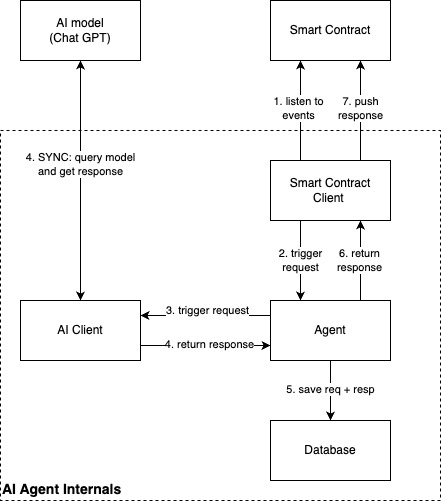

# BrainPump

## Project Overview

BrainPump is a simple dApp built on EVM and launched as a RollApp, combining smart contracts and AI to create a simple yet engaging betting game. Users participate by guessing a random number generated by an AI within a specified range. Correct guesses win a prize, while incorrect guesses contribute to the house pool.

This project consists of multiple Solidity smart contracts working together to manage users, events, AI interactions, and the betting system.

## How It Works

### User Interaction

1. Users submit their bets through the dApp interface, specifying the range (N to M) and their guessed number (currently N and M are hardcoded to 1 and 10).

2. Each bet is recorded on-chain, along with the user’s address and bet amount. The funds are automatically transferred to the house pool and locked until the bet is resolved.

3. The smart contract submits a request to the AI Oracle contract with the prompt stating "Generate a number between N and M, inclusive".

🔥 Coming soon:
* Configurable N and M;
* User-specified prompt prepended to the AI model's input. Prompt may try to bribe the AI, or ask it to generate some specific number.

### AI Number Generation

1. The AI Oracle contract records the requested prompt in the on-chain event manager. In general case, the prompt is an arbitrary string, which will be used as a seed for the AI model.

2. The backend (also known as the AI Agent) fetches the request from the event manager passes the prompt to the AI model. Then it waits for the AI model response, saves all the answer-related information to the local storage, and sends the response back to the AI Oracle contract.

3. AI Oracle persists the AI model response along with the prompt ID.

### Result Validation

1. The user submits a transaction to check the result of their bet. The smart contract retrieves the AI-generated answer associated with the prompt, and compares it to the user’s guess. In the case of BrainPump, the AI answer is always a number string without any additional information, but in general it's an arbitrary string.

2. If the user’s guess matches the AI-generated number, they win a share of the house pool. The prize is distributed proportionally to the winning bets based on the total bet amount. Otherwise, the house retains the bet amount.

3. If the user does not trust the AI Agent and is willing to verify that the AI model response was not tampered with, they can request the additional AI response information from the AI Agent. The AI Agent provides the thread ID and the assistant ID, that can be used to fetch the full conversation from the AI model provider.

## Key Components
1. **AI Oracle**: The AI Oracle contract interacts with an off-chain AI Agent to request prompts and retrieve answers.

2. **AI Agent**: The AI Agent is an off-chain component that interacts with the AI model. It fetches prompts from the AI Oracle contract, processes them, and sends back the AI Oracle. It serves as the bridge between the blockchain and the AI, ensuring the integrity of the prompting process.

3. **AIGambling and House contracts**: The AIGambling contract acts as the main interface for users. It integrates other contracts to streamline the betting process, from user interactions to resolving outcomes. Users interact with this contract to place their bets. The House contract manages the prize pool and payouts. It handles bet deposits, maintains the house balance, and distributes rewards to winning participants.

4. **Helpers: Whitelist and EventManager contracts**: The Whitelist contract ensures that only authorized addresses can interact with specific parts of the system. This maintains security and restricts access to trusted participants or administrators. The EventManager contract manages the lifecycle of betting events. It allows the creation, tracking, and resolution of events associated with the derived contract. 