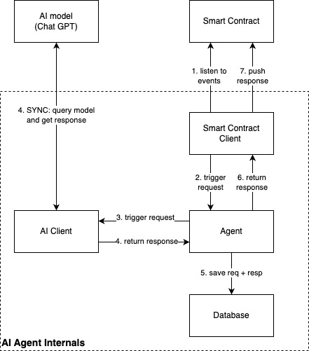

# Desmos

## Project Overview

Desmos is an AI Agent built on EVM and launched as a RollApp. Users can double their money by trying to jailbreak Desmos to choose a specific number within a range by providing a jailbreak prompt. All revenue made by Desmos is being distributed by it's stakers.

This project consists of multiple Solidity smart contracts working together to manage users, events, AI interactions, and the betting system.

### [Try it out](https://desmos.fun)

## How It Works

### AI Number Generation

1. The AI Oracle contract records the requested prompt in the on-chain event manager. In general case, the prompt is an arbitrary string, which will be used as a seed for the AI model.

2. The backend (also known as the AI Agent) fetches the request from the event manager passes the prompt to the AI model. Then it waits for the AI model response, saves all the answer-related information to the local storage, and sends the response back to the AI Oracle contract.

3. AI Oracle persists the AI model response along with the prompt ID.

### Result Validation

1. The user submits a transaction to check the result of their jailbreak attempt. The smart contract retrieves the AI-generated answer associated with the prompt, and compares it to the user’s guess. In the case of Desmos, the AI answer is always a number string without any additional information, but in general it's an arbitrary string.

2. If the user’s chosen number matches the AI-generated number, they double their money. Otherwise, the house retains the bet amount which is divided prorata between it's stakers.

3. If the user does not trust the AI Agent and is willing to verify that the AI model response was not tampered with, they can request the additional AI response information from the AI Agent by clicking the `Verify Game Result` button.

## Key Components
1. **AI Oracle**: The AI Oracle contract interacts with an off-chain AI Agent to request prompts and retrieve answers.

2. **AI Agent**: The AI Agent is an off-chain component that interacts with the AI model. It fetches prompts from the AI Oracle contract, processes them, and sends back the AI Oracle. It serves as the bridge between the blockchain and the AI, ensuring the integrity of the prompting process. 

3. **AIGambling and House contracts**: The AIGambling contract acts as the main interface for users. It integrates other contracts to streamline the betting process, from user interactions to resolving outcomes. Users interact with this contract to place their bets. The House contract manages the prize pool and payouts. It handles bet deposits, maintains the house balance, and distributes rewards to winning participants.

4. **Helpers: Whitelist and EventManager contracts**: The Whitelist contract ensures that only authorized addresses can interact with specific parts of the system. This maintains security and restricts access to trusted participants or administrators. The EventManager contract manages the lifecycle of betting events. It allows the creation, tracking, and resolution of events associated with the derived contract. 
