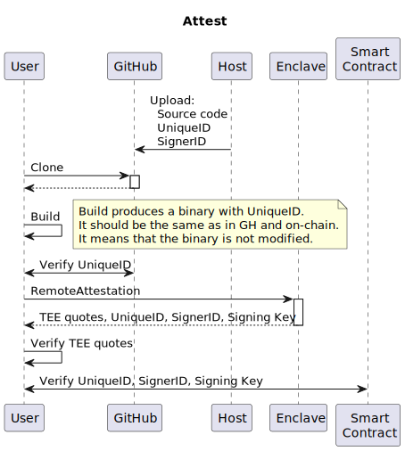
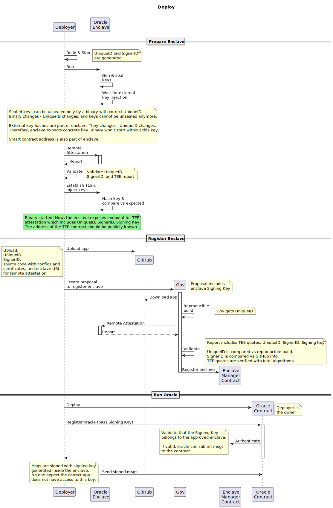
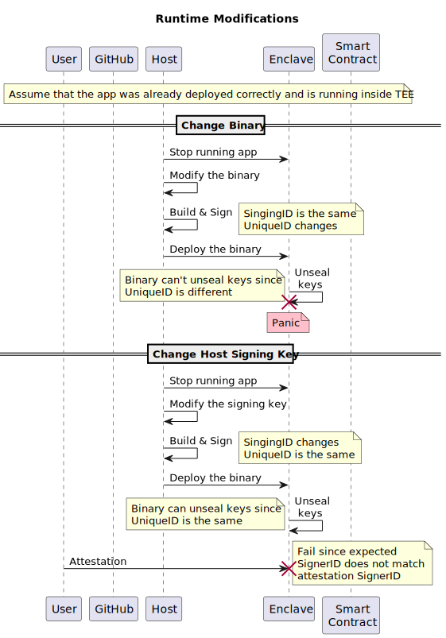
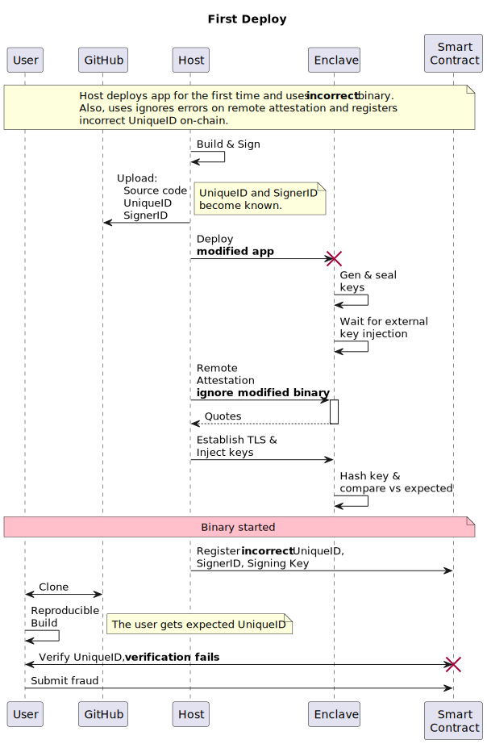

# TEE Oracle

This project showcases the off-chain oracle run in the TEE. Oracle system requirements:

- Run the oracle on some cloud server
- Application should persist keys that will be the same even after restarts
- Keys should not be known for anyone except the oracle. Neither OS admin, VM host, oracle developer, nor deployer.
- The oracle should have some persistent state within restarts
- We need a way to validate the integrity of the oracle. So that if the oracle is not modified in runtime (eg by the OS admin, deployer, or operator)
- Potentially, we need a way to verify inputs/outputs of the oracle
- The oracle do not trust anyone except the binary with correct measurement

For above requirements, Intel SGX is the most quitable solution.

## Renting Intel SGX VM

There are two main Intel SGX proviers: Alibaba and Microsoft Azure. We will use Azure as it is more common. This tutorial uses a Ubuntu machine hosted in Azure. Useful links: 
- [How to create Azure Intel SGX VM](https://learn.microsoft.com/en-us/azure/confidential-computing/quick-create-marketplace)
- [Short SGX enclaves guide from Azure](https://learn.microsoft.com/en-us/azure/confidential-computing/confidential-computing-enclaves)
- [Alibaba TEE SDK](https://www.alibabacloud.com/help/en/ecs/user-guide/build-an-sgx-encrypted-computing-environment)

Once you are inside the VM, you can can ensure Intel SGX is presented:

```bash
ls /dev/sgx*
```

## Prerequisites

### VM

Install Golang:

```bash
wget https://go.dev/dl/go1.23.5.linux-amd64.tar.gz
sudo tar -C /usr/local -xzf go1.23.5.linux-amd64.tar.gz
export PATH=$PATH:/usr/local/go/bin
```

The oracle is written in Go and uses EGo framework to compile an enclave-ready binary from the native Go code. 

- [Install EGo](https://github.com/edgelesssys/ego/tree/master?tab=readme-ov-file#install-the-snap)
- In some cases, you need to unstall [a special EGo runtime](https://github.com/edgelesssys/edgelessrt?tab=readme-ov-file#quick-start)

For remote attestation, you will need [a quote provider](https://github.com/edgelesssys/edgelessrt?tab=readme-ov-file#quick-start). After installation, you will have a configuratin file in `/etc/sgx_default_qcnl.conf`. For Alibaba, refer to [its documentation](https://www.alibabacloud.com/help/en/ecs/user-guide/build-an-sgx-encrypted-computing-environment). If you host in Azure, use the following config is battle tested: 

```json
{
  // *** ATTENTION : This file is in JSON format so the keys are case sensitive. Don't change them.
  "pccs_url": "https://global.acccache.azure.net/sgx/certification/v4/",
  "use_secure_cert": true,
  "collateral_service": "https://api.trustedservices.intel.com/sgx/certification/v4/",
  "pccs_api_version": "3.1",
  "retry_times": 6,
  "retry_delay": 5,
  "local_pck_url": "http://169.254.169.254/metadata/THIM/sgx/certification/v4/",
  "pck_cache_expire_hours": 48,
  "verify_collateral_cache_expire_hours": 48,
  "custom_request_options" : {
       "get_cert" : {
          "headers": {
              "metadata": "true"
          },
          "params": {
             "api-version": "2021-07-22-preview"
         }
      }
   } 
}
```

### Local 

If you'd like to deploy the full stack including the oracle contract, you need to install the following deps on your machine:
- [Node.js](https://nodejs.org/) (v14 or later)
- [Hardhat](https://hardhat.org/)

Additionally, you need have access to any instance of RollApp EVM. You can either have a RollApp running in [Testnet](https://testnet.dymension.xyz/) or run it locally using [instructions from the repo](https://github.com/dymensionxyz/rollapp-evm/tree/v3.1.0-drs6?tab=readme-ov-file#installing--getting-started).

## Run

To run the oracle in the Intel SGX machine, clone this repo and navigate to the `desmos-ai-agent/backend-sgx` folder. Then, build, sign, and run the enclave:

```bash
ego-go build
ego sign oracle
ego run oracle
```

It will generate `private.pem` and `public.pem` keys automatically. Alternatively, you can create your own keys (see the openssl command) or import you own known keys. To apply your key, run `ego sign oracle` again before running.
```bash
openssl genrsa -out private.pem -3 3072
```

## General Info

### Identifiers

The oracle is run inside the enclave. You can imagine the enclave as a Docker conrainer with its own filesystem. The code measurement or UniqueID is a unique identifier of the concrete enclave (like a digest of the container). If some part of the enclave changes – UniqueID also changes. For example, if one changes the code of the oracle and then run it inside the enclave, UniqueID would be different. However, when the code is returned to the initial state, UniqueID will be back to the initial value as well. This enables enclaves to be reproducible: anyone who has access to SGX processor could build the enclave and verify its UniqueID.

The enclave has SignerID. This is the unique identifier of the one who signed the enclave before running. If the `private.pem` key changes, SignerID changes.

### Sealing

The enclave could seal and unseal objects. Sealing encrypts the given byte slice using the unique enclave sealing key. The sealing key depends on the UniqueID. Therefore, if we seal some data, change the binary, and try to unseal the data, the operation would fail as UniqueID would mismatch.

### Storage

The enclave could be extended with external data if a few ways:
- Mounts: like in a docker image, a piece of host's filesystem is mounted to the enclave. This is particulary useful to create persistent objects that live along the enclave reboots (by default the enclave filesystem is wiped upon every restart). The mounts are not part of the enclave, so if the mounted directory changes its content, UniqueID stays the same. In the oracle example, unique keys of the oracle are stored in mounted directory, so they can be re-used on restarts. The keys are encrypted, so only the enclave could access them (more details later).
- Files: like mounts but are part of the enclave, so changing affects UniqueID. For example, the config might be stored as an enclave file to ensure integrity.
- Env vars: the same as files.

If the application needs some extended persistent storage, it can mount the folder from the host machine and encode the data using the enclave sealing key. The approach is to generate a random encryption key to unlock the storage and then seal it. Thus, only the valid application can unseal the key and decrypt the data.

### Network

All the network interaction should be upgraded to use TLS which needs secure certificates to operate. It unsecure to trust the host OS certificates (from `/etc/ssl/certs/ca-certificates.crt` folder), thus the trusted certificates could be stored statically and included inside the enclave as a file. The attestation should be performed before the TLS connection is obtained. This is to ensure that the client communicates with the expected geniune TEE (eg it might verify SignerID or UniqueID).

### Key Injection

The application needs a way to inject the keys without revealing them. Furthermore, external verifiers need to verify the integrity (ie correctness of UniqueID) without knowning the correct key. For this reason, the hash of the correct key could be stored in the config file which is part of the enclave. Then, the application won't start until someone (presumably the owner of the app) uploads a correct key. Upon upload, the hash of the key is calculated and the compared against the stored value. If there is a match, the application starts.

## Diagrams

### Attest


### Deploy


### Runtime Modifications


### Dishonest Deploy


## Glossary

* **UniqueID** A unique ID of the code (measurement). Changes when code changes.
* **SignerID** A unique ID of the host. Changes when the host changes.
* **Signing Key** A unique ID of the app instance. Changes when a new instance is deployed.